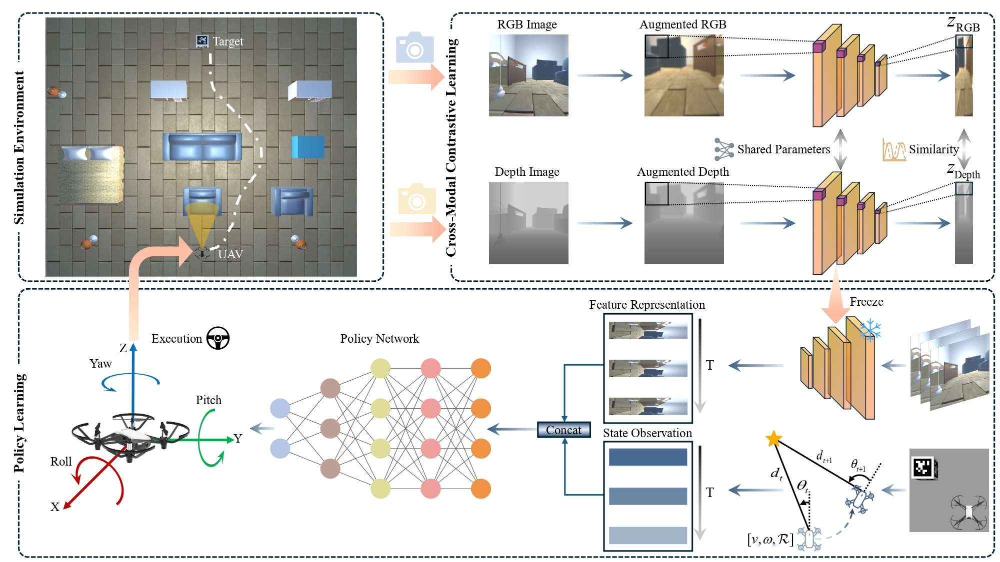
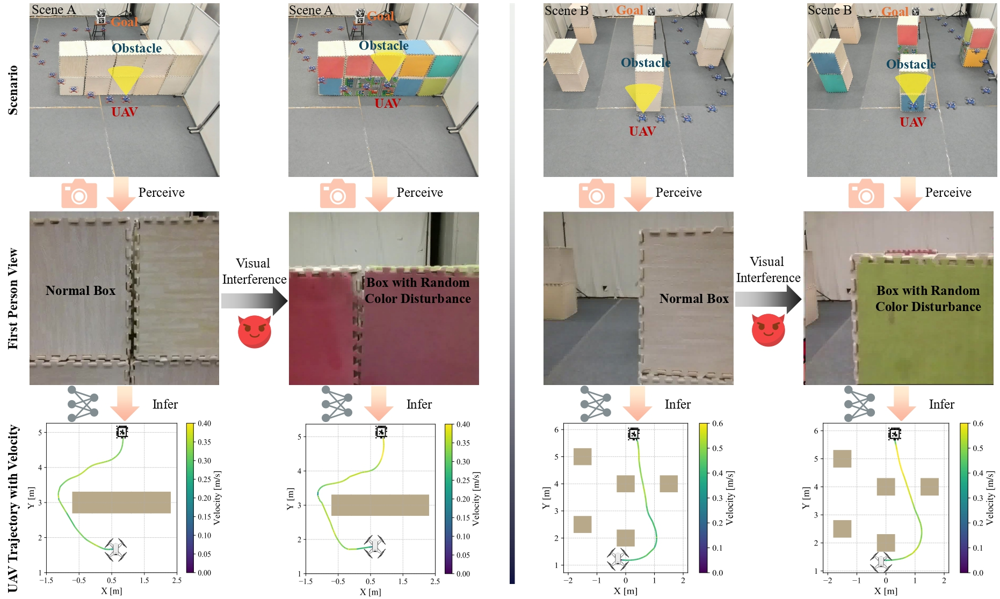
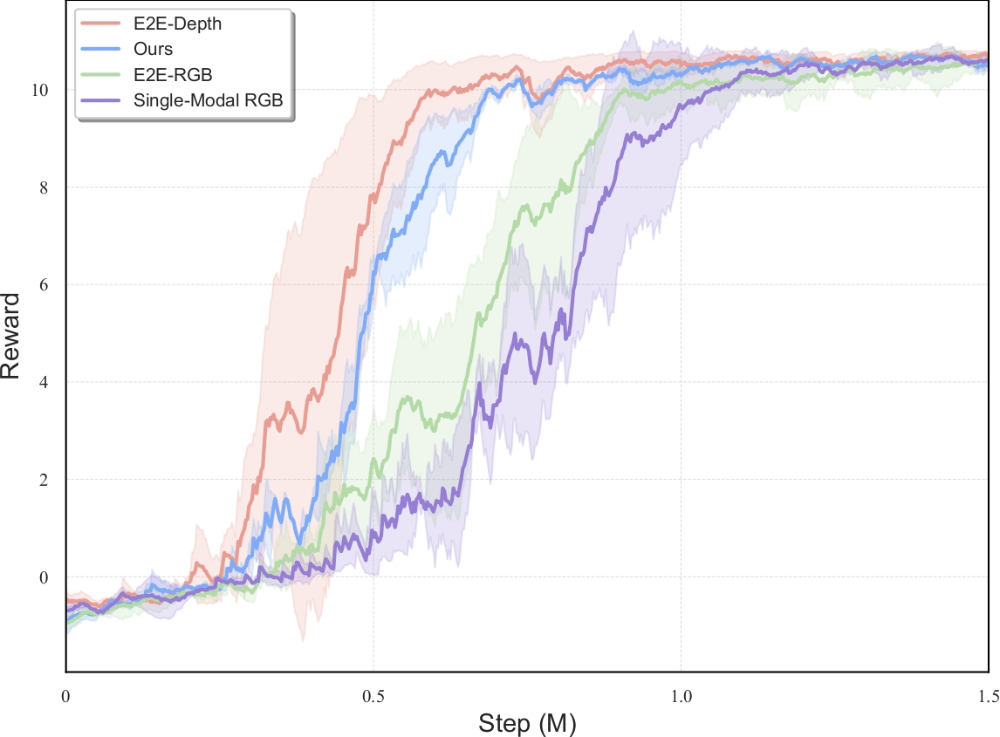
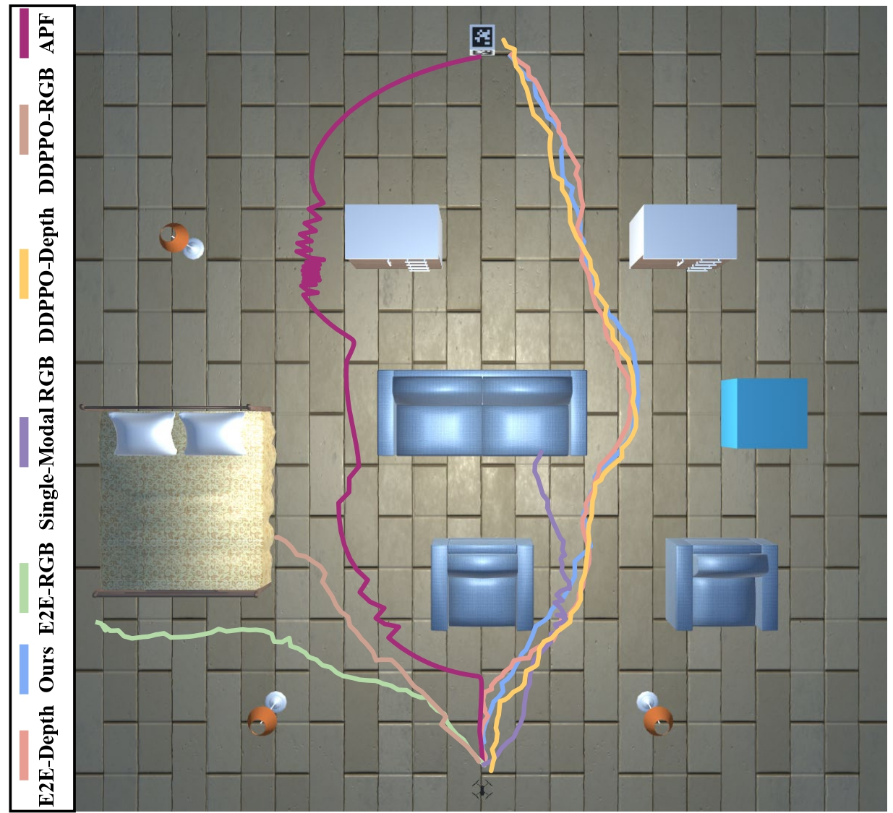
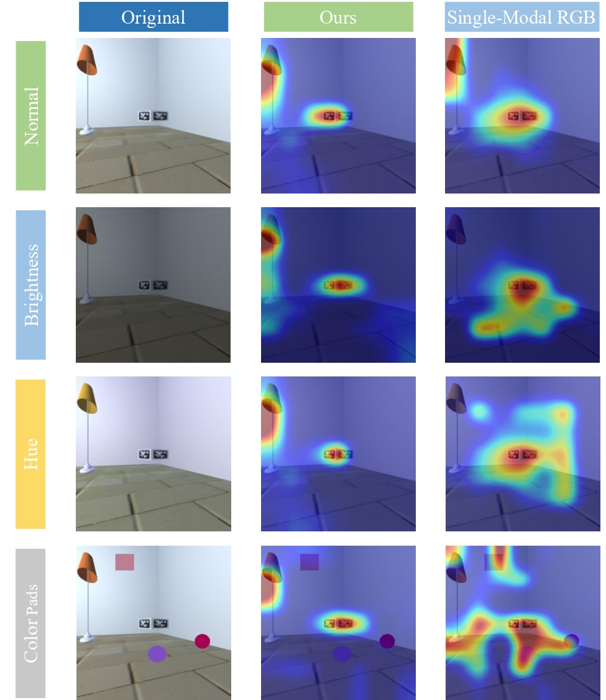
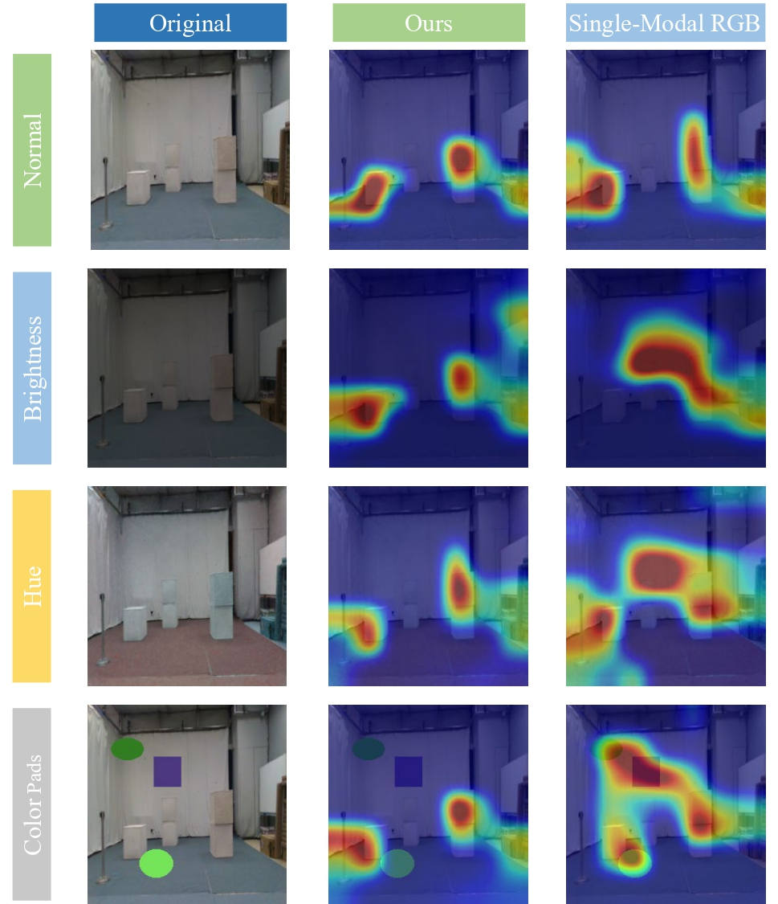

# Learning Cross-Modal Visuomotor Policies for Autonomous Drone Navigation
:rocket:A Unity-based framework that enhances monocular UAV navigation robustness against visual interference through cross-modal contrastive learning.

<p align="center">
  
</p>


<p align="center">
  
</p>


<p align="center">
  
</p>

<!-- Improved compatibility of back to top link: See: https://github.com/othneildrew/Best-README-Template/pull/73 -->
<a id="readme-top"></a>
<!--
*** Thanks for checking out the Best-README-Template. If you have a suggestion
*** that would make this better, please fork the repo and create a pull request
*** or simply open an issue with the tag "enhancement".
*** Don't forget to give the project a star!
*** Thanks again! Now go create something AMAZING! :D
-->


<!-- PROJECT SHIELDS -->
<!--
*** I'm using markdown "reference style" links for readability.
*** Reference links are enclosed in brackets [ ] instead of parentheses ( ).
*** See the bottom of this document for the declaration of the reference variables
*** for contributors-url, forks-url, etc. This is an optional, concise syntax you may use.
*** https://www.markdownguide.org/basic-syntax/#reference-style-links
-->
 <!--[![Contributors][contributors-shield]][contributors-url] -->
<!-- [![Forks][forks-shield]][forks-url] -->
<!--[![Stargazers][stars-shield]][stars-url] -->
<!--[![Issues][issues-shield]][issues-url] -->
[![MIT License][license-shield]][license-url] 
<!--[![LinkedIn][linkedin-shield]][linkedin-url] -->


<!-- TABLE OF CONTENTS -->
<details>
  <summary>Table of Contents</summary>
  <ol>
    <li>
      <a href="#about-the-project">About The Project</a>
      <ul>
      </ul>
    </li>
    <li>
      <a href="#getting-started">Getting Started</a>
      <ul>
        <li><a href="#installation-and-usage">Installation and Usage</a></li>
      </ul>
    </li>
    <li><a href="#dataset">Dataset</a></li>
    <li><a href="#results">Results</a></li>
    <li><a href="#license">License</a></li>
    <li><a href="#contact">Contact</a></li>
  </ol>
</details>


<!-- ABOUT THE PROJECT -->
## About The Project

This project focuses on enhancing the navigation capabilities of UAVs in visually challenging environments using a Unity-based simulation framework. The learning framework combines **cross-modal contrastive learning** and **deep reinforcement learning** to acquire robust visuomotor policies from monocular RGB observations. A fixed **resnet-based encoder** trained with RGB-depth contrastive objectives is used to extract transferable visual representations, which are then used to train a navigation policy using **Proximal Policy Optimization (PPO)**.


> ⚠️ **Note**  
> Due to the large size and complexity of Unity-based simulation environments, we only release the code of **feature encoder**, which allows you to extract robust representations from RGB images for downstream tasks such as reinforcement learning.  
> 🧠 The feature encoder can be easily integrated with your own simulator.  
> 🔧 If you're looking for simple Gazebo-based UAV navigation examples, you can check out our other projects on GitHub:  
> ➡️ **[gazebo_uav_RL](https://github.com/zzzzzyh111/gazebo_uav_RL)**

> ➡️ **[NonExpert-Guided-Visual-UAV-Navigation-Gazebo](https://github.com/zzzzzyh111/NonExpert-Guided-Visual-UAV-Navigation-Gazebo)**


This work has been published in [IEEE Robotics and Automation Letters (RAL)](https://ieeexplore.ieee.org/document/10960642). Please kindly refer to the following format for citations if needed :clap: :clap: :clap:

```bibtex
@article{zhang2025learning,
  title={Learning Cross-Modal Visuomotor Policies for Autonomous Drone Navigation},
  author={Zhang, Yuhang and Xiao, Jiaping and Feroskhan, Mir},
  journal={IEEE Robotics and Automation Letters},
  year={2025},
  publisher={IEEE}
}
```

<p align="right">(<a href="#readme-top">back to top</a>)</p>


<!-- GETTING STARTED -->
## Getting Started


### Installation and Usage

1. Clone the repo
   ```sh
   git clone https://github.com/zzzzzyh111/CL4Nav.git
   ```
2. Create the conda environment
   ```sh
   conda env create --name cl4nav --file env.yml
   conda activate cl4nav
   ```

3. Install required packages
   ```sh
   pip install -r requirements.txt
   ```
4. Run the script
   ```sh
   python3 run.py
   ```
Before running CL4Nav, make sure you choose the correct running configurations. You can change the running configurations by passing keyword arguments to the ```run.py``` file.

```python
$ python run.py -rgb-path ./datasets/RGB -depth-path ./datasets/Depth --dataset-name uav
```
If you want to run it on CPU (for debugging purposes) use the ```--disable-cuda``` option.

For 16-bit precision GPU training, there **NO** need to to install [NVIDIA apex](https://github.com/NVIDIA/apex). Just use the ```--fp16_precision``` flag and this implementation will use [Pytorch built in AMP training](https://pytorch.org/docs/stable/notes/amp_examples.html).


<p align="right">(<a href="#readme-top">back to top</a>)</p>


<!-- Overview of Other Scripts -->
## Dataset
A small sample dataset is provided for evaluation and testing.  
You can download it from the following Google Drive link:

🔗 [Sample Dataset](https://drive.google.com/file/d/1PjifJkg0OEAjeXJRcTimFM3O1EljDrOP/view?usp=drive_link)

After downloading, please **extract the archive** and place the resulting `RGB/` and `Depth/` folders into the project's `datasets/` directory:
<p align="right">(<a href="#readme-top">back to top</a>)</p>

<!-- Results -->
## Results
<p align="center">
  
</p>

<p align="center">
  
</p>

<p align="center">
  
    
</p>


<p align="right">(<a href="#readme-top">back to top</a>)</p>

<!-- LICENSE -->
## License

Distributed under the MIT License. See `LICENSE` for more information.

<p align="right">(<a href="#readme-top">back to top</a>)</p>


<!-- CONTACT -->
## Contact

Yuhang Zhang  - yuhang004@e.ntu.edu.sg

Project Link: [https://github.com/zzzzzyh111/CL4Nav](https://github.com/zzzzzyh111/CL4Nav)

<p align="right">(<a href="#readme-top">back to top</a>)</p>


<!-- MARKDOWN LINKS & IMAGES -->
<!-- https://www.markdownguide.org/basic-syntax/#reference-style-links -->
[contributors-shield]: https://img.shields.io/github/contributors/github_username/repo_name.svg?style=for-the-badge
[contributors-url]: https://github.com/github_username/repo_name/graphs/contributors
[forks-shield]: https://img.shields.io/github/forks/github_username/repo_name.svg?style=for-the-badge
[forks-url]: https://github.com/github_username/repo_name/network/members
[stars-shield]: https://img.shields.io/github/stars/github_username/repo_name.svg?style=for-the-badge
[stars-url]: https://github.com/github_username/repo_name/stargazers
[issues-shield]: https://img.shields.io/github/issues/github_username/repo_name.svg?style=for-the-badge
[issues-url]: https://github.com/github_username/repo_name/issues
[license-shield]: https://img.shields.io/github/license/othneildrew/Best-README-Template.svg?style=for-the-badge
[license-url]: https://github.com/zzzzzyh111/NonExpert-Guided-Visual-UAV-Navigation-Gazebo/blob/main/LICENSE
[linkedin-shield]: https://img.shields.io/badge/-LinkedIn-black.svg?style=for-the-badge&logo=linkedin&colorB=555
[linkedin-url]: https://linkedin.com/in/linkedin_username
[product-screenshot]: images/screenshot.png
[Next.js]: https://img.shields.io/badge/next.js-000000?style=for-the-badge&logo=nextdotjs&logoColor=white
[Next-url]: https://nextjs.org/
[React.js]: https://img.shields.io/badge/React-20232A?style=for-the-badge&logo=react&logoColor=61DAFB
[React-url]: https://reactjs.org/
[Vue.js]: https://img.shields.io/badge/Vue.js-35495E?style=for-the-badge&logo=vuedotjs&logoColor=4FC08D
[Vue-url]: https://vuejs.org/
[Angular.io]: https://img.shields.io/badge/Angular-DD0031?style=for-the-badge&logo=angular&logoColor=white
[Angular-url]: https://angular.io/
[Svelte.dev]: https://img.shields.io/badge/Svelte-4A4A55?style=for-the-badge&logo=svelte&logoColor=FF3E00
[Svelte-url]: https://svelte.dev/
[Laravel.com]: https://img.shields.io/badge/Laravel-FF2D20?style=for-the-badge&logo=laravel&logoColor=white
[Laravel-url]: https://laravel.com
[Bootstrap.com]: https://img.shields.io/badge/Bootstrap-563D7C?style=for-the-badge&logo=bootstrap&logoColor=white
[Bootstrap-url]: https://getbootstrap.com
[JQuery.com]: https://img.shields.io/badge/jQuery-0769AD?style=for-the-badge&logo=jquery&logoColor=white
[JQuery-url]: https://jquery.com 